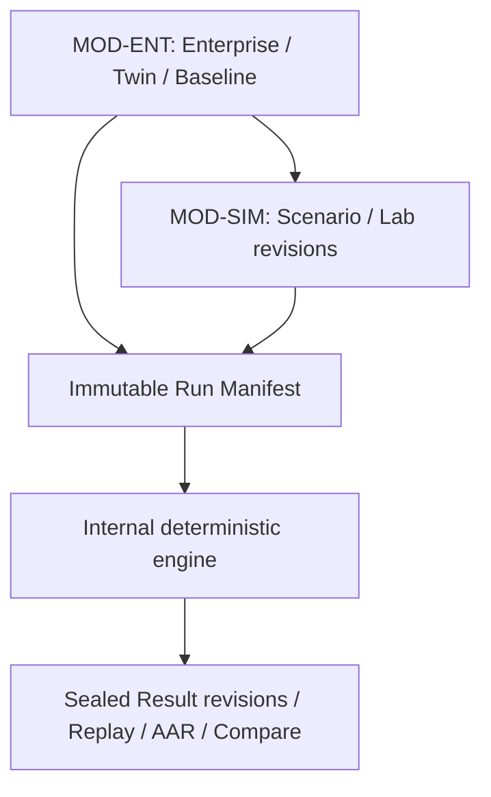

# مخطط W03 الرئيسي للعمل — A–M

**إلى:** Controller A + Parent  
**الحالة:** مخرج تخطيط `READ-ONLY` للتقييم المستقل والتحكيم، وليس إذن تنفيذ أو قبول منتج.  
**التاريخ:** 2026-08-31  
**المستودع:** `hamad933/Cybersecurity-Education-Platform`  
**فرع التخطيط:** `snapshot/cep-w03-work-master-planner-02-20260831`  
**SHA المثبت:** `8b81a8a387578a34a1f679e5df440ce870417775`  
**Git tree:** `8ae42a846944e81f40eff6f36ecf36e58654a7bf`  
**مرجع الصورة الحالية:** رأس PR #59 المراجع `10dee917ce8912dc593f123603236019337bea33`  

> هذا المستند يحدد خطة التنفيذ واختبارات إثباتها فقط. لا يغيّر GitHub أو Google Drive، ولا يقبل أو يجمّد أو يدمج أو يصدر أو ينشر أي مرشح.

## A. هوية الجلسة، القرار التنفيذي، والحدود

### A.1 القرار التنفيذي

المسار الصحيح ليس إعادة تلميع الواجهات الحالية، بل إكمال سلسلة منتج واحدة محكومة:

`Enterprise Definition → Digital Twin Revision → Baseline → Scenario/Lab Definition → Immutable Run Manifest → Deterministic Runtime → Sealed Result Revision → Replay/AAR/Compare → Candidate Evidence Handoff`

المكوّنات الحالية تثبت أجزاءً من السلسلة، لكنها لا تكوّن منتج W03 مكتملًا:

- مساحات Enterprise وScenario وLab هي قارئات لتعريفات منشورة، وليست أدوات تأليف محكومة.
- محرك التشغيل حتمي وقابل للتتبع ضمن نطاق ضيق جدًا، لكنه لا يشغّل بنية Scenario/Lab الفعلية بعد.
- قدرة Results R10 موجودة ومجمّدة داخل `RunResultCapability`، لكنها غير موصّلة إلى المسارات أو استعلامات الصفحة أو واجهات Replay/AAR/Compare.
- واجهة PR #59 تقترب بصريًا من لغة العمل، لكنها تعرض عدة أدوات معطلة، وسياقًا عامًا بدل سياق العنصر المحدد، وتفقد هندسة Scenario عند العرض المتوسط.

لذلك تكون أولوية التنفيذ: سلامة الملكية والتعريفات أولًا، ثم تجميد Run Manifest وتوسيع المحرك، ثم توصيل Results، ثم تقارب الواجهة البصري والتفاعلي فوق حقائق مكتملة.

### A.2 ثوابت النطاق

1. توجد خمس مناطق رئيسية فقط: Enterprise، Scenarios، Labs، Runs، Results.
2. Operations وضع داخل Run، وليس منطقة سادسة.
3. Replay وAAR وCompare أوضاع داخل Results.
4. Scenario Run وStandalone Lab Run هما نوعا التشغيل الوحيدان في V1.
5. المحاكاة داخلية فقط؛ لا Docker أو Kubernetes أو SSH أو SIEM خارجي أو أي منفذ تنفيذ حقيقي.
6. التعريفات المنشورة، Baselines، Run Manifests، الأحداث، العمليات، اللقطات، checkpoints، والنتائج المختومة لا تُعدّل في موضعها.
7. W03 ينشئ Candidate Evidence Handoff من جهة المصدر فقط؛ لا يكتب إلى Evidence أو Review أو Decision أو Mastery.
8. الحالة التشغيلية لا تعدّل Enterprise أو Twin أو Baseline أو Scenario أو Lab.
9. كل معرف أو digest أو timestamp تقني يعرض داخل نطاق `LTR` مستقل، بينما يبقى الغلاف والمحتوى العربي `RTL`.
10. Dark/full-desktop هو الأساس البصري؛ `768px` دليل هندسة متوسط عند الحاجة، وليس نسخة منتج مستقلة.

### A.3 حالة الاعتماد

- Results R10 موجود في SHA المثبت، ومسموح توصيله دون إعادة تنفيذ منطق قدرته.
- SIMDEF R08 ما زال Active Writer وغير مجمّد، وغير موجود في SHA المثبت. لا تُفترض ملفاته أو مخططه الحالي، ولا تُنسخ أعماله M/N/O داخل W03.
- بدء تنفيذ W03 مشروط بتحكيم Controller A + Parent لمصير SIMDEF، وتحديد SHA أساس جديد خالٍ من التصادمات.

## B. سجل الأدلة وحقيقة الحالة الحالية

### B.1 ترتيب السلطات المقروء

تمت القراءة بالترتيب الملزم التالي:

| الترتيب | السلطة | Drive ID | كيفية الاستخدام |
|---:|---|---|---|
| 1 | Work Start Desktop Priority | `1snDmHyxDj3VlXJNrgqE9NVYozCiYaMWi` | قواعد الجلسة، ترتيب القراءة، استراتيجية الدليل |
| 2 | CEP Current State | `1TyNrR29bK9RUKj4EH86dcN9wqDFiWYSX` | الحالة المجمّدة، الكاتب النشط، حدود القبول |
| 3 | A01 Unified Workspace | `1bTmKuLGWJ9JnLmEkP0a5E1_M2p1cGaoV` | نموذج مساحة العمل وسلسلة الحالة |
| 4 | A02 Simulation & Enterprise | `1Ic0PJR88E7154PFAZcN4p8KIi_e6ayi7` | ملكية المجالات، lifecycle، engine، Results |
| 5 | Final Visual Contract | `1hJQzFnwN1VNtbAJi3wiAtBQy07IxLD1P` | قواعد TOP/LEFT/CENTER/RIGHT/BOTTOM وBidi |
| 6 | Visual Reference Register | `1l97eSpCZ0tsNGDgEhHXmiyjhoCgpuEz4` | الصور المرجعية الملزمة الحالية |
| 7 | Wave04 Adjudication | `1sVH9QX-tA_Hn7qPUKnWISEcrP1jJn_V4` | Enterprise/Labs findings المقبولة |
| 8 | Wave06 Adjudication | `11WH8k4ObEugUbwUtrCqDkb57wR-FsNBJ` | Scenarios/Runs/Results findings المقبولة |
| 9 | SIMDEF packet v1.1 | `16K7eLwuVd-xTRHwxsTIWpTs_PsQ1Xu_0` | عقد كاتب نشط، لا حقيقة مجمّدة |
| 10 | Results packet v1.0 | `1qPAnWvHius9eIYf-rmIxLTeuKm7w3FsF` | حدود R10 وقدرته المجمّدة |
| 11 | Work Quality Model | `17JDJ0UlQgdSxr-h-XEjmEf3E3TPbLwK_` | جودة الخطة وطوبولوجيا المراجعة اللاحقة |

### B.2 الأدلة المرئية المستخدمة

| السطح | المرجع الملزم | الحالي Dark/1440 | دليل إضافي | نتيجة المقارنة |
|---|---|---|---|---|
| Enterprise | `REF_01_ENTERPRISE_DIGITAL_TWIN.png`، Drive `1IfsOYaSNA2treLUpGkKDDz3kOhA0MpXn` | `CURRENT_01_ENTERPRISE_1440_DARK_10dee917.png`، Drive `12u6ZaiEoYIiNc6ShtaoxrlclE3nUuOxs` | Twin/Baseline، Drive `1_nv_rkiwJmoRJe2OChEhb-QemvFcRLd_`; و768، Drive `1lAXDUTUm0aKNEe0MvEPcrO2054f39Z6h` | المرجع يطلب نموذج كيان/علاقة، مصادر وخصائص للعنصر المحدد، وتمييز Enterprise-backed/Simulation-local؛ الحالي يرسم ثلاثة nodes من JSON وروابط `UNLABELED` وسياقًا عامًا. |
| Scenarios | `REF_02_SCENARIOS.png`، Drive `1hQ592tjL3FF-ZgufqONB1BbS0uskWhhm` | `CURRENT_02_SCENARIOS_1440_DARK_10dee917.png`، Drive `1hc4jMqTuePqPj4YcD6Nef9uHWAaF_e0E` | 768، Drive `1x8Bsbjvgjnzjnt_6wgxMGCIonc0rY6Vj` | المرجع Studio كامل؛ الحالي قارئ مراحل، ويطابق Lab Module بالـ ordinal. عند 768 ينضغط module lane إلى عمود شبه غير مقروء. |
| Labs | `REF_03_LABS.png`، Drive `1iWttx2eZ8pkUMOQ0a-8G0-qJ2z8hW32K` | `CURRENT_03_LABS_1440_DARK_10dee917.png`، Drive `1WMoMRHlCx_SLxoMeHw5j3IbYC9ljHikc` | 768، Drive `10eCF_e7CDb65NfDaLxR_x5A6gvx6LbCl` | المرجع يعرض graph غير خطي وحقولًا محكومة وسياق task؛ الحالي يحوّل `configuration.steps` إلى صف خطي ويعرض JSON خامًا. |
| Runs | `REF_04_RUNS_OPERATIONS.png`، Drive `11svhyV5Ofq9HGzWQzK-c6qUGSAw7rawU` | `CURRENT_04_RUNS_1440_DARK_10dee917.png`، Drive `1VJZXYc44ac_zc3GxbabBEDiDTmCZxeGL` | Preflight، Drive `15YgucBLO4V1300cE0xwBkaUAxx2mFUq8`; و768، Drive `1gNtrzA7wKMqp33C4P8b1h0-1sSRIRysb` | المرجع active operations؛ الحالي صورة Run مكتمل، بأحداث/عملية/لقطات فقط، ولا يثبت أدوات حالة RUNNING. تظهر telemetry تاريخية كسلسلة مفككة، ما يثبت غياب تطبيع عقد القراءة. |
| Results | `REF_05_RESULTS_REPLAY.png`، Drive `1zZGxZWnSn2HSpKGrqcGtCNjif2JkVa3Y` | `CURRENT_05_RESULTS_1440_DARK_10dee917.png`، Drive `1_5ZXywl3P_tgLYsoetSuSGLXLnND00Y0` | AAR، Drive `14TleX6sX6hs_IME7Vx1DeFqVvMHeZHup`; Compare، Drive `1TtZLGjwkpPwh8UD5IYc-QYg636ik3llU`; و768، Drive `1V37G3x6iMXscTjb_om1j_uIvNB_VLm-6` | Replay الحالي يعرض timeline مختومًا، لكن state-at-point placeholder، ولا tabs لـ AAR/Compare، ولا اختيار نتائج، ولا مراجعات فعالة. |

### B.3 فجوات الدليل التي يجب ألا تتحول إلى افتراض

| الفجوة | التصنيف | أثرها على التنفيذ |
|---|---|---|
| لا توجد صورة حالية تمثيلية لحالة Run نشطة | `RUNTIME_VERIFICATION_REQUIRED` | لا يُقبل Operations UI من صورة Run مكتمل؛ يلزم fixture أو سيناريو متحكم به يمر PREPARING/READY/RUNNING/PAUSED/terminal. |
| لا توجد صور حالية مطابقة لـ AAR وCompare | `RUNTIME_VERIFICATION_REQUIRED` | تستخدم صور الدعم كعقد IA، ثم تُثبت البيانات الفعلية من projections في المتصفح. |
| لا توجد لقطة حالية موثوقة قرب 1024px | `RUNTIME_VERIFICATION_REQUIRED` غير حاجب | المصدر و1440/768 كافيان للبدء. تؤخذ 1024 فقط إن كان capture حتميًا منخفض التكلفة. |
| شكل SIMDEF النهائي غير موجود في SHA | `AUTHORITY_DECISION_REQUIRED` | لا يبدأ أي تعديل متصادم في Enterprise/Labs/migrations قبل تجميد الكاتب أو إغلاقه. |

## C. سجل النتائج المادية الملزم بالتنفيذ

### C-01 — لا يوجد نموذج Enterprise entity/relationship canonical

- **ID:** `W03-C01`
- **severity:** `BLOCKER`
- **evidence type:** `IMAGE_AND_SOURCE_VERIFIED`
- **observed evidence:** المرجع يعرض كتالوج كيانات وعلاقات typed؛ الحالي يرسم `revision.topology.nodes/links` فقط، والروابط بلا نوع فتظهر `UNLABELED`. المصدر `topologyNodes()` و`topologyLinks()` يقرأ JSON من `simulation_digital_twin_revisions`، بينما `simulation_enterprises.definition` كتلة JSON غير مفككة.
- **root cause:** نموذج Wave 1 جعل Digital Twin topology هو مخزن الرسم الفعلي بدل projection فوق Enterprise-owned entities/relationship revisions.
- **authority basis:** A02، Wave04 `ENTERPRISE-IPA-ARCH-01`، Final Visual Contract.
- **exact files:** `DatabaseSimulationEnterpriseStateReader.php`، `SimulationEnterpriseStateReader.php`، `SimulationEnterpriseFixtureWriter.php`، migration Wave 1، `EnterpriseSurface.vue`، `EnterpriseContext.vue`، `types.ts`، `projections.ts`.
- **exact symbols/components:** `listForSimulationWorkspace()`، `revisionArray()`، `publishDigitalTwinRevision()`، `topologyNodes()`، `topologyLinks()`، `selectedNodeId`.
- **implementation change:** استهلاك كيان وعلاقة revision محكومين من MOD-ENT؛ جعل Twin revision يحتوي references مثبتة إلى revisions مع قائمة Simulation-local صريحة؛ بناء projection واحد للرسم والسياق من هذا العقد.
- **state/data impact:** stable entity identity منفصل عن versioned state؛ العلاقة تحمل type/direction/source revision؛ المنشور immutable.
- **Bidi impact:** labels عربية RTL؛ IDs وأنواع العلاقات والدجست LTR؛ لا خلط اتجاه داخل SVG labels.
- **desktop/medium impact:** 1440 يخصص CENTER للرسم وRIGHT للعنصر؛ 768 يستخدم قائمة graph دلالية لا SVG مضغوطًا.
- **dependencies:** SIMDEF M وتحديد عقد read-only من MOD-ENT.
- **prohibited shortcuts:** لا استخراج entities من أسماء nodes، لا تخزين catalog جديد في MOD-SIM، لا تسمية الروابط افتراضيًا.
- **tests required:** contract tests للهوية/revision/provenance، ownership boundary، projection tests، روابط مجهولة ترفض عند validate.
- **browser/runtime checks:** اختيار node/link يحدّث RIGHT، تبديل revision يحافظ على Twin ويعيد ضبط selection فقط عند غياب العنصر.
- **completion criteria:** كل node/link المرئي قابل للرد إلى Enterprise revision أو Simulation-local record صريح، ولا يظهر `UNLABELED` في تعريف منشور صالح.

### C-02 — lifecycle الـ Twin والـ Baseline ومسار Create Baseline غير مكتمل

- **ID:** `W03-C02`
- **severity:** `BLOCKER`
- **evidence type:** `IMAGE_AND_SOURCE_VERIFIED`
- **observed evidence:** صورة الدعم تتطلب Draft/Validate/Publish/Create Baseline وprovenance/compatibility؛ المصدر fixture writer ينشر مباشرة، و`EnterpriseBaselineService` الحالي يخدم نموذج Enterprise آخر ولا ينشئ `simulation_baselines`.
- **root cause:** لا توجد capability إنتاجية موحدة لتأليف Twin revision والتحقق منه ونشره وإنشاء Baseline منه؛ الكاتب الوحيد للمسار الحالي fixture writer.
- **authority basis:** A02، Wave04 `LIFE-03`، SIMDEF N، دعم Twin/Baseline.
- **exact files:** `SimulationEnterpriseFixtureWriter.php`، `DatabaseSimulationEnterpriseStateReader.php`، `EnterpriseBaselineService.php`، `WorkspaceToolbar.vue`، `EnterpriseSurface.vue`، `EnterpriseDeepDetail.vue`.
- **exact symbols/components:** `publishDigitalTwinRevision()`، `publishBaseline()`، `publishedRevision()`، toolbar actions.
- **implementation change:** استهلاك capability الإنتاجية التي يجمّدها SIMDEF؛ إظهار draft revision editor، validate report، publish gate، ثم Create Baseline من published revision فقط مع digest وcompatibility summary.
- **state/data impact:** `DRAFT → VALIDATED → PUBLISHED`؛ النشر وBaseline من نوع append-only؛ ويثبت Baseline مراجعات Twin وEnterprise الدقيقة.
- **Bidi impact:** الأفعال عربية؛ الحالة والمعرفات التقنية داخل LTR spans.
- **desktop/medium impact:** actions في TOP؛ revision history في LEFT؛ impact/compatibility في RIGHT؛ 768 يحولها إلى tabs/sections متتابعة.
- **dependencies:** SIMDEF M/N وقرار collision map.
- **prohibited shortcuts:** لا Create Baseline من draft، لا تعديل published revision، لا إعادة استخدام fixture writer في request path.
- **tests required:** transition matrix، digest determinism، concurrent publish uniqueness، immutable triggers، baseline provenance.
- **browser/runtime checks:** disabled reasons مرئية، publish لا يتاح قبل validation ناجح، Create Baseline يعرض revision المثبت.
- **completion criteria:** مسار مستخدم كامل ينشئ draft ويصححه وينشره وينشئ Baseline دون كتابة مباشرة من UI إلى JSON خام.

### C-03 — Scenario منشور قابل لتغيير المعنى بعد النشر

- **ID:** `W03-C03`
- **severity:** `BLOCKER`
- **evidence type:** `SOURCE_CONTRACT_VERIFIED`
- **observed evidence:** `publishScenario()` يحسب digest قبل Lab references؛ `attachLabModule()` يضيف صفوفًا لاحقًا لأي Scenario، و`prepareScenarioRun()` يقرأ الصفوف الحية. جدول references يفتقد `phase_id` ويستخدم `ordinal`.
- **root cause:** Lab references ليست ضمن وحدة النشر أو digest، ولا يوجد trigger يمنع تعديلها عندما يكون الأب PUBLISHED.
- **authority basis:** A02، Wave06 `REVISION-02` و`SEMANTICS-04`.
- **exact files:** `SimulationEnterpriseService.php`، migration Wave 1، `SimulationEnterpriseController.php`، `ScenarioSurface.vue`، `types.ts`.
- **exact symbols/components:** `publishScenario()`، `attachLabModule()`، `prepareScenarioRun()`، `scenario.lab_module_references.some(item.ordinal === phase.ordinal)`.
- **implementation change:** draft aggregate يجمع orchestration وreferences؛ references تحمل `phase_id` ثابتًا وexact lab revision؛ validation ثم publication transaction واحدة تحسب digest على الكل؛ trigger يمنع تغيير child rows بعد النشر.
- **state/data impact:** إضافة lifecycle VALIDATED، `published_at`، `supersedes_id` أو lineage مكافئ، `phase_id`، وdigest manifest canonical.
- **Bidi impact:** لا أثر عقدي عدا عزل phase/module keys LTR.
- **desktop/medium impact:** phase selection والسياق يعتمدان IDs لا الترتيب البصري.
- **dependencies:** SIMDEF O أو عقد Lab revision مجمّد.
- **prohibited shortcuts:** لا إبقاء ordinal كرابط دلالي، لا إعادة حساب digest عند القراءة، لا تحديث صف منشور.
- **tests required:** post-publish mutation rejection، digest includes references، clone-to-new-revision، phase deletion/reference validation.
- **browser/runtime checks:** نقل phase في draft لا يفقد module؛ المنشور read-only؛ Prepare يثبت نفس manifest المعروض.
- **completion criteria:** لا يمكن أن يتغير Run input لمعرفة Scenario revision نفسها بعد نشرها.

### C-04 — Scenario Studio الحالي قارئ ناقص وليس أداة تأليف

- **ID:** `W03-C04`
- **severity:** `BLOCKER`
- **evidence type:** `IMAGE_AND_SOURCE_VERIFIED`
- **observed evidence:** المرجع يضم Environment/Roles/Phases/Events/Injects/Decisions/Lab Modules/Tasks/Rules/Observability/Completion؛ الحالي يعرض `orchestration.phases` وLab references فقط مع رسالة أن التحرير غير متاح.
- **root cause:** `ScenarioItem.orchestration` هو `JsonMap` opaque، و`ScenarioSurface` يحول قائمة phases إلى عرض خطي دون schema أو selection state.
- **authority basis:** A02، Wave06 `PRODUCT-01` و`COVERAGE-07`، Final Visual Contract.
- **exact files:** `SimulationEnterpriseService.php`، `SimulationEnterpriseController.php`، `ScenarioSurface.vue`، `ScenarioContext.vue`، `ScenarioDeepDetail.vue`، `Workspace.vue`، `types.ts`، `projections.ts`، `workspace.css`، routes.
- **exact symbols/components:** `scenariosData()`، `ScenarioItem`، `phases` computed، `structureGroups`.
- **implementation change:** schema-versioned Scenario draft؛ editors typed لكل facet؛ flow canvas يختار phase/event/inject/decision/module؛ RIGHT يعرض ويدقق العنصر المحدد؛ TOP يحوي Save/Validate/Publish/Prepare وفق الحالة.
- **state/data impact:** حفظ draft منفصل عن published؛ validation report ذو stable codes؛ no Run target داخل definition.
- **Bidi impact:** النص العربي `RTL`، والمعرفات وتعبيرات القواعد `LTR`، ومسار flow الفيزيائي `LTR` مع labels معزولة.
- **desktop/medium impact:** 1440 matrix متوازنة؛ 768 تتحول إلى phase list + nested inspector بدل ضغط أربعة أعمدة.
- **dependencies:** C-03، Lab revision contract، Environment Contract validator.
- **prohibited shortcuts:** لا textarea JSON كمسار أساسي، لا بيانات mock، لا actions موزعة خارج TOP.
- **tests required:** typed validation لكل facet، keyboard selection، draft persistence، unsaved changes، publish gate.
- **browser/runtime checks:** إنشاء عنصر وتحديده ونقله وربطه ثم validate/publish؛ العودة تحفظ context.
- **completion criteria:** يستطيع المستخدم تأليف Scenario صالح كاملًا دون تحرير JSON يدوي، ويكون كل عنصر مرئيًا وقابلًا للاختيار.

### C-05 — Lab contract opaque وخطي ولا يدعم Lab-local

- **ID:** `W03-C05`
- **severity:** `BLOCKER`
- **evidence type:** `IMAGE_AND_SOURCE_VERIFIED`
- **observed evidence:** المصدر يفرض `enterprise_id` و`baseline_id` غير nullable، ويخزن `configuration` و`validation` بصيغة JSON؛ الواجهة تقرأ `configuration.steps` فقط وتعرض Linear Dependency. المرجع يطلب graph وحقولًا محكومة وسياق task.
- **root cause:** تعريف Lab ليس aggregate schema-versioned، ولا يفصل environment mode أو nodes/edges أو lifecycle.
- **authority basis:** A02، Wave04 `LABS-FUNC-01/GRAPH-02/ENV-03/DEF-04/VALID-05/REV-06/IA-07`، SIMDEF O.
- **exact files:** `SimulationEnterpriseService.php`، migration Wave 1، `SimulationEnterpriseController.php`، `LabSurface.vue`، `LabContext.vue`، `LabDeepDetail.vue`، `WorkspaceToolbar.vue`، `types.ts`.
- **exact symbols/components:** `publishLab()`، `labsData()`، `LabItem`، `steps` computed.
- **implementation change:** عقد Lab v2 يضم purpose، knowledge links، capabilities/devices، environment، initial state، task nodes/edges، preconditions، roles/tools، actions، signals، validation، safety/reset، result schema، completion؛ وضع `LAB_LOCAL` أو `ENTERPRISE_PINNED` بقيود متبادلة.
- **state/data impact:** lab revision append-only؛ `baseline_id` nullable فقط لـ LAB_LOCAL؛ exact pinned revision لـ ENTERPRISE_PINNED؛ digest يغطي العقد كاملًا.
- **Bidi impact:** أوامر/IDs LTR، الوصف والتعليمات RTL، graph connectors لا تغيّر المعنى عند RTL.
- **desktop/medium impact:** graph قابل للتمرير الأفقي بحدود واضحة على 1440؛ عند 768 يتحول إلى focus + outline ولا يقطع task ثالثًا.
- **dependencies:** تجميد SIMDEF O؛ لا ازدواجية مع كاتبه.
- **prohibited shortcuts:** لا استنتاج edges من ترتيب array، لا baseline وهمي لـ LAB_LOCAL، لا حقول حرة بدل facets.
- **tests required:** schema validation، graph reachability/cycle policy، environment mutual constraints، reset/safety، digest، revision lifecycle.
- **browser/runtime checks:** branch/optional task، اختيار node، validation errors anchored، prepare لكل environment mode.
- **completion criteria:** التعريف يعبّر عن graph غير خطي وحالتَي البيئة، وRun preparation يستهلك revision نفسه لا JSON حيًا.

### C-06 — لا يوجد Run Manifest مجمّد ولا Preflight منتجي كامل

- **ID:** `W03-C06`
- **severity:** `BLOCKER`
- **evidence type:** `IMAGE_AND_SOURCE_VERIFIED`
- **observed evidence:** صورة Preflight تتطلب source/environment/run type/mode/roles/readiness/dependencies؛ المصدر يكتب IDs و`input_digest` في `simulation_runs` لكنه يعيد قراءة Scenario references الحية ولا يخزن manifest شاملًا.
- **root cause:** prepare ينشئ run مباشرة بدل فصل Preview/Validate/Commit مع manifest immutable.
- **authority basis:** A02 Run Manifest، Wave06 runtime، دعم Preflight.
- **exact files:** `SimulationEnterpriseService.php`، controller، routes، migration Wave 1، `WorkspaceToolbar.vue`، `RunSurface.vue`، `RunContext.vue`.
- **exact symbols/components:** `compatiblePreparationTargets()`، `prepareScenarioRun()`، `prepareStandaloneLabRun()`، `insertRun()`.
- **implementation change:** capability تبني Preflight projection دون كتابة؛ commit واحد ينشئ immutable manifest يثبت definition revisions، baseline lineage، roles/mode/seed، engine/rule versions، Lab module instances، readiness report digests.
- **state/data impact:** جدول `simulation_run_manifests` واحد لكل run مع immutable trigger؛ `input_digest` يصبح digest للmanifest canonical.
- **Bidi impact:** readiness prose عربي؛ contract keys/digests LTR.
- **desktop/medium impact:** Preflight surface داخل Runs قبل الإنشاء؛ TOP actions Save/Preflight/Prepare/Start وفق الحالة.
- **dependencies:** C-03/C-05، frozen Enterprise/Baseline contract.
- **prohibited shortcuts:** لا snapshot من current DB بعد start، لا زر Start يتجاوز mandatory checks، لا تضمين object mutable بالمرجع.
- **tests required:** deterministic manifest، compatibility failures، stale revision detection، concurrent prepare، no write on preflight.
- **browser/runtime checks:** blocked mandatory check يعطل Prepare/Start ويعرض السبب والمالك؛ successful commit يعرض نفس digest.
- **completion criteria:** يمكن إعادة بناء كل input للتشغيل من manifest واحد مختوم دون قراءة تعريف حي.

### C-07 — المحرك الحتمي موجود لكنه ضيق ولا ينفذ Scenario/Lab semantics

- **ID:** `W03-C07`
- **severity:** `BLOCKER`
- **evidence type:** `SOURCE_CONTRACT_VERIFIED`
- **observed evidence:** controller وservice يقبلان فقط `SET_CONTROL_STATE` على `IDENTITY_MFA` بقيمة boolean؛ completion يتطلب عملية واحدة؛ لا schedule/conditional/phase/event/inject/decision/task engine، ولا مسار فعلي إلى FAILED.
- **root cause:** `OPERATION_GRAMMAR` V1 proof slice تحول إلى محرك المنتج الوحيد، مع lifecycle أوسع من الأسباب التي يستطيع engine إنتاجها.
- **authority basis:** A02 deterministic internal engine، Wave06 `ARCH-01`، Results R10 V1 constraints.
- **exact files:** `SimulationEnterpriseService.php`، `SimulationEnterpriseController.php`، routes، migration Wave 1، `RunResultVocabulary.php`، `RunResultCapability.php`، `RunSurface.vue`، `RunContext.vue`.
- **exact symbols/components:** `applyOperation()`، `assertOperation()`، `applyOperationGrammar()`، `completeInternalSimulation()`، `TRANSITIONS`، `validateOperation()`.
- **implementation change:** engine v2 version-dispatched ينفذ scheduled/conditional transitions، phases، events، injects، decisions، Lab tasks، signals، validation، outputs/artifacts؛ كل command يعيد status/reason code/rule trace/pre-post digests. V1 replay يبقى صالحًا.
- **state/data impact:** append-only operation/event records؛ runtime instances منفصلة؛ FAILED يسجل failure event/code وtimestamp؛ definitions لا تتغير.
- **Bidi impact:** commands/reason codes LTR؛ explanations عربية قابلة للترجمة.
- **desktop/medium impact:** Operations يعرض focus/current task والأدوات المتاحة من engine state، لا من mock UI.
- **dependencies:** C-06؛ schema contracts؛ Results projector registry.
- **prohibited shortcuts:** لا shell/network، لا `if` خاص بكل fixture داخل controller، لا نتائج عشوائية خارج seed/rule version.
- **tests required:** deterministic replay، action result matrix، phase/task reachability، pause/resume، FAILED، reset epoch، no external connectors، V1 regression.
- **browser/runtime checks:** run نشط كامل، denial/no-state-change، pause/resume، failure، terminal seal.
- **completion criteria:** Scenario/Lab المنشوران ينتجان transitions وtelemetry/artifacts قابلة لإعادة البناء حتميًا.

### C-08 — Operations UI لا يملك state contract آمنًا ولا يثبت الحالة النشطة

- **ID:** `W03-C08`
- **severity:** `MATERIAL`
- **evidence type:** `IMAGE_AND_SOURCE_VERIFIED`
- **observed evidence:** صورة 1440/768 الحالية Run مكتمل؛ current phase/role/task غير متاح؛ telemetry تظهر أحرف `enabled` موزعة. `RuntimeState.telemetry` typed كـ record لكن template يكرر أي قيمة دون guard.
- **root cause:** read DTO لا يتحقق من schema/version، وواجهة عامة تعالج سجلات تاريخية غير متجانسة؛ لقطة القبول لا تغطي RUNNING.
- **authority basis:** Wave06 `ARCH-02`، Final Visual Contract، قواعد الأدلة.
- **exact files:** `SimulationEnterpriseController.php`، `types.ts`، `projections.ts`، `RunSurface.vue`، `RunContext.vue`، `RunDeepDetail.vue`، `workspace.css`.
- **exact symbols/components:** `runsData()`، `RuntimeState`، telemetry `v-for`، `selectedSequence`.
- **implementation change:** DTO versioned مع normalizers fail-closed؛ active operations tabs/focus؛ فصل operational facts في CENTER عن interpretation في RIGHT؛ fixture matrix لكل lifecycle.
- **state/data impact:** لا backfill لحقائق مختومة؛ legacy values تعرض كـ unsupported contract مع raw detail في BOTTOM، والجديد يكتب v2 صحيحًا.
- **Bidi impact:** الجداول التقنية LTR داخل container؛ العناوين والتفسير RTL.
- **desktop/medium impact:** 1440 split bounded؛ 768 tabs/stack دون فقد selection؛ لا شبكة أحرف.
- **dependencies:** C-07.
- **prohibited shortcuts:** لا cast صامت لسلسلة إلى object، لا قبول Run مكتمل كدليل للحالة النشطة، لا نسخ interpretation إلى CENTER.
- **tests required:** DTO malformed fixtures، lifecycle UI matrix، selection persistence، empty/loading/error.
- **browser/runtime checks:** كل lifecycle مع controls الصحيحة، keyboard tabs، long UUIDs، telemetry object/legacy.
- **completion criteria:** لا تعرض UI حقلاً بصيغة مضللة، وتوجد لقطة runtime متحكم بها لحالة RUNNING.

### C-09 — Results R10 غير موصل، وAAR/Compare/revisions غير متاحة للمستخدم

- **ID:** `W03-C09`
- **severity:** `BLOCKER`
- **evidence type:** `IMAGE_AND_SOURCE_VERIFIED`
- **observed evidence:** `RunResultCapability` يوفر Replay/AAR/Compare/create revision/handoff envelope؛ controller يقرأ canonical result وخدمة قديمة فقط ولا يحقن capability. UI يعرض Result واحدًا، placeholder للحالة، وزر replay-compare القديم.
- **root cause:** R10 نفذ capability lane مستقلة عمدًا بلا controller/routes/UI wiring؛ لم تُنجز integration phase.
- **authority basis:** Results packet R10، Wave06 `PRODUCT-01/FUNCTION-02/FUNCTION-03/HANDOFF-04`، صور Replay/AAR/Compare.
- **exact files:** `RunResultCapability.php`، `RunResultVocabulary.php`، result revision migration، `SimulationEnterpriseController.php`، `SimulationEnterpriseService.php`، routes، `ResultSurface.vue`، `ResultContext.vue`، `ResultDeepDetail.vue`، `WorkspaceToolbar.vue`، `types.ts`.
- **exact symbols/components:** `projectReplayState()`، `projectAarState()`، `projectCompareRuns()`، `createResultRevision()`، `generateCandidateEvidenceHandoffEnvelope()`، `resultsData()`.
- **implementation change:** query/integration service يضمن initial effective revision، يستدعي projections الصفرية الكتابة، ويوفر modes Result/Replay/AAR/Compare؛ create correction append-only؛ handoff يمر envelope إلى الكاتب الحالي الوحيد.
- **state/data impact:** revisions append-only؛ canonical result لا يتغير؛ compare لا يكتب حقيقة جديدة إلا cache اختياري محكوم؛ W04 stores خارج النطاق.
- **Bidi impact:** summaries عربية؛ diff dimensions/digests/timestamps LTR؛ mixed labels معزولة.
- **desktop/medium impact:** mode tabs في TOP/CENTER؛ handoff/export في TOP؛ analytical interpretation في RIGHT؛ 768 يحتفظ بمرشحَي المقارنة واضحين.
- **dependencies:** C-07 projector versioning؛ Results R10 موجود.
- **prohibited shortcuts:** لا نسخ منطق capability في service، لا تعديل canonical result، لا كتابة Evidence/Mastery، لا AAR نص مولد بلا sealed facts.
- **tests required:** wiring feature tests، initial revision backfill/idempotency، multi-hop corrections، AAR facts، compare distinct runs، handoff writer uniqueness.
- **browser/runtime checks:** Replay step state، AAR، Compare 2+، correction lineage، handoff disabled reasons.
- **completion criteria:** كل mode يعرض projection من effective revision، ويمكن تعقب كل قيمة إلى sealed history.

### C-10 — ملكية الاختيار والسياق موزعة داخل الأسطح

- **ID:** `W03-C10`
- **severity:** `MATERIAL`
- **evidence type:** `IMAGE_AND_SOURCE_VERIFIED`
- **observed evidence:** `Workspace` يملك record فقط؛ `EnterpriseSurface` يملك Twin/revision/node محليًا؛ RIGHT لا يستقبل selected node. Scenario/Lab لا يملكان selected element. RIGHT يكرر سياق aggregate العام.
- **root cause:** لا يوجد Workspace selection model مشترك بين LEFT/CENTER/RIGHT/TOP أو query string.
- **authority basis:** A01، Final Visual Contract، Wave04 `CTX-04/IA-07`، Wave06 `INTERACTION-06`.
- **exact files:** `Workspace.vue`، كل Surface/Context، `StructureList.vue`، `WorkspaceToolbar.vue`، `types.ts`.
- **exact symbols/components:** `selectedId`، `selectedTwinId`، `selectedRevisionId`، `selectedNodeId`، `selectedSequence`، `selectedIndex`.
- **implementation change:** رفع selection إلى `WorkspaceSelection` typed؛ تمريره props/events؛ مزامنة bounded مع URL؛ back navigation يحفظ context؛ reset فقط عند invalidation.
- **state/data impact:** UI state فقط، لا كتابة domain.
- **Bidi impact:** لا أثر على البيانات؛ focus order يتبع المعنى لا الاتجاه الفيزيائي.
- **desktop/medium impact:** نفس selection يستمر عند إخفاء/إظهار panels وعند stack 768.
- **dependencies:** typed DTOs لكل surface.
- **prohibited shortcuts:** لا global store مكرر لبيانات domain، لا RIGHT مستقل يختار سجلًا آخر، لا duplicated action homes.
- **tests required:** selection reducer، URL restore، record change invalidation، keyboard/focus.
- **browser/runtime checks:** LEFT/CENTER/RIGHT متزامنة، back/forward، panel collapse، 1440/768.
- **completion criteria:** يوجد مصدر selection واحد، وRIGHT يشرح العنصر المحدد فعلًا.

### C-11 — هندسة العرض المتوسط تفشل قبل breakpoint الداخلي

- **ID:** `W03-C11`
- **severity:** `MATERIAL`
- **evidence type:** `IMAGE_AND_SOURCE_VERIFIED`
- **observed evidence:** عند 768 يتحول `CepWorkspaceLayout` إلى عمود عند `64rem`، لكن `.sim-phase-row` لا تتحول إلى صف مبسط إلا عند `40rem`؛ ينتج Lab Module lane ضيق جدًا. 1440 أيضًا يضغط Labs/Scenario داخل CENTER المحصور بين panelين.
- **root cause:** breakpoints الخارجية والداخلية غير متعاقدة؛ min-widths الثابتة في phase matrix تفترض canvas أعرض من المتاح.
- **authority basis:** Final Visual Contract، tiered 1440/768 evidence.
- **exact files:** `CepWorkspaceLayout.vue`، `resources/css/app.css`، `workspace.css`، `ScenarioSurface.vue`، `LabSurface.vue`، `RunSurface.vue`، `ResultSurface.vue`.
- **exact symbols/components:** `gridStyle`، `@media (max-width:64rem)`، `.sim-phase-row`، `.sim-task-graph`، `.sim-operations-workbench`، `.sim-replay-workbench`.
- **implementation change:** contract-based container/breakpoint modes؛ عند 64rem تتحول scenario matrix إلى outline + focused detail، والعمليات/Replay إلى tabs أو stack؛ graph يحتفظ بتمرير ظاهر واختصار لا يقطع العقد.
- **state/data impact:** لا أثر.
- **Bidi impact:** physical LEFT/RIGHT لا ينقلبان؛ connectors والـ SVG LTR مع content RTL.
- **desktop/medium impact:** 1440 أساس الكثافة؛ 768 لا يحمل four-column internals؛ 1024 capture اختياري للتحقق.
- **dependencies:** C-10 selection model.
- **prohibited shortcuts:** لا `overflow:hidden` لإخفاء المحتوى، لا تصغير خط عام، لا اعتبار 768 mobile منفصلًا.
- **tests required:** screenshot/geometry assertions 1440 و768، no horizontal page overflow، focus visibility.
- **browser/runtime checks:** long Arabic/English labels، panel collapsed/expanded، all five surfaces.
- **completion criteria:** لا نص عمودي متكسر أو controls مقصوصة أو page-level horizontal scroll.

### C-12 — query/read boundary واسع وغير مضبوط الأداء والعقد

- **ID:** `W03-C12`
- **severity:** `MATERIAL`
- **evidence type:** `SOURCE_CONTRACT_VERIFIED`
- **observed evidence:** controller ينفذ N+1 queries لكل run/result/enterprise، يفك JSON إلى arrays غير versioned، ويحمل 50 سجلًا مع جميع الأحداث واللقطات والعمليات دفعة واحدة.
- **root cause:** controller يجمع query model وmapping وHTTP actions؛ لا pagination أو summary/detail split أو DTO validation.
- **authority basis:** A01 ownership، Work quality implementation binding، A02 no duplicate stores.
- **exact files:** `SimulationEnterpriseController.php`، `DatabaseSimulationEnterpriseStateReader.php`، `SimulationEnterpriseService.php`، `types.ts`.
- **exact symbols/components:** `render()`، `scenariosData()`، `labsData()`، `runsData()`، `resultsData()`، `listForSimulationWorkspace()`.
- **implementation change:** query services bounded؛ summary list منفصل عن selected detail؛ eager/batched queries؛ cursor pagination؛ schema/version adapters؛ controller thin.
- **state/data impact:** read path فقط؛ لا cache يصبح source of truth.
- **Bidi impact:** لا أثر.
- **desktop/medium impact:** loading/empty/error مستقل لكل region ويحافظ على الهيكل.
- **dependencies:** contracts في D/E.
- **prohibited shortcuts:** لا إضافة cache غير مبطل، لا تحميل raw payload لكل row، لا إخفاء decode errors.
- **tests required:** query-count ceilings، pagination، malformed JSON fail-closed، authorization، selected detail not found.
- **browser/runtime checks:** 50+ records، slow detail، error recovery، selection after page change.
- **completion criteria:** عدد الاستعلامات bounded، وحجم payload الأولي لا يتناسب طرديًا مع مجموع السجلات التاريخية.

## D. معمارية الهدف، الملكية، وعقود الحدود

### D.1 مصفوفة الملكية

| الحقيقة | المالك canonical | المستهلك في W03 | الممنوع |
|---|---|---|---|
| Enterprise entities وrelationship revisions | MOD-ENT | Twin editor، Scenario/Lab validation، Run manifest | جدول مكرر داخل MOD-SIM |
| Digital Twin identity/revision وBaseline | MOD-ENT | تعريفات W03 وpreflight | mutation من runtime |
| Scenario/Lab revisions | MOD-SIM definitions | Run preparation | attachment حي بعد النشر |
| Run Manifest وinstances وevents/operations | MOD-SIM runtime | Operations وResults | إعادة قراءة definition حي لتفسير run |
| canonical sealed Result | MOD-SIM results | effective revisions/projections | update/delete |
| Candidate Evidence handoff | MOD-SIM source writer الوحيد | W04 intake لاحقًا | كتابة W04 stores |

### D.2 حدود الخدمات المستهدفة

1. `SimulationEnterpriseStateReader` يبقى عقد MOD-ENT read-only، ويُوسّع بعقود DTO لا ORM ولا DB facade في interface.
2. `SimulationEnterpriseController` يصبح HTTP adapter فقط؛ لا queries مركبة ولا canonicalization.
3. `SimulationEnterpriseService` الحالي يُفصل تدريجيًا إلى capabilities: Definition Query، Scenario Authoring، Lab Authoring، Run Preparation، Run Execution، Result Integration. لا big-bang rename قبل collision review.
4. `RunResultCapability` يبقى مالك projection/revision logic؛ integration layer يستدعيه ولا ينسخه.
5. كل capability يقبل/يعيد DTO schema-versioned ويملك validation codes ثابتة.

## E. خطة البيانات والمهاجرات والحفاظ على التاريخ

### E.1 بوابة ما قبل المهاجرات

قبل أي ملف migration جديد، يثبت Controller A + Parent:

- SHA النهائي لـ SIMDEF أو قرار إيقافه.
- الجداول/الأعمدة/الخدمات التي أضافها، خصوصًا M/N/O.
- collision map مقابل migration Wave 1 و`SimulationEnterpriseService.php` وreader وtests.
- أن Results migration الموجودة لم تُستبدل أو تُعدل.

### E.2 مبدأ التغيير

- لا تعديل للمهاجرات المنشورة `2026_08_14_010300...` أو `2026_08_19_020000...`.
- كل تغيير additive أولًا، ثم قيود fail-closed بعد backfill المتحكم به.
- لا UPDATE لأي history مختوم؛ records القديمة تُقرأ عبر version adapters.
- أي backfill مشتق يضيف صفًا جديدًا idempotent ولا يغيّر canonical payload أو digest.

### E.3 ملفات migration المقترحة بعد تحكيم SIMDEF

| الملف المقترح | التغيير الملزم |
|---|---|
| `database/migrations/2026_09_01_000100_harden_simulation_definition_revision_contracts.php` | lifecycle VALIDATED، `schema_version`، `published_at`، lineage، `phase_id`، exact Lab revision، قيود immutable child rows، Lab environment mode. يُحذف من خطة W03 كل جزء نفذه SIMDEF بالفعل. |
| `database/migrations/2026_09_01_000200_add_simulation_run_manifests_and_instances.php` | `simulation_run_manifests` immutable، phase/task/module instances، uniqueness وFKs إلى exact revisions. |
| `database/migrations/2026_09_01_000300_extend_simulation_operation_engine_v2.php` | grammar/status/reason/rule trace/output/artifact digests، دون كسر V1؛ immutable triggers لكل append-only table. |
| `database/migrations/2026_09_01_000400_complete_run_result_revision_integration.php` | indexes/query constraints فقط عند الحاجة؛ لا تعديل canonical result؛ backfill الأولي منفصل وقابل للتدقيق. |

### E.4 عقود schema الدنيا

**Scenario v2:** `identity`, `environment_contract`, `roles`, `phases`, `events`, `injects`, `decisions`, `lab_modules`, `tasks`, `rules`, `observability`, `completion`, `validation`, `schema_version`.

**Lab v2:** `purpose`, `knowledge_links`, `capabilities`, `devices`, `environment_mode`, `environment_contract`, `initial_state`, `task_nodes`, `task_edges`, `preconditions`, `roles`, `tools`, `actions`, `signals`, `validation`, `safety`, `reset`, `result_schema`, `completion`, `schema_version`.

**Run Manifest v1:** exact Enterprise/Twin/Baseline revisions والدجست، exact Scenario/Lab revisions والدجست، module mapping، mode/roles/seed، engine/rule versions، readiness report، provenance، created_by/at.

**Operation v2:** `operation_key`, `grammar_version`, `command_type`, `target_ref`, `input`, `status`, `reason_code`, `rule_trace`, `pre_state_digest`, `post_state_digest`, `outputs`, `telemetry`, `artifacts`, `actor_id`, `occurred_at`.

## F. خطة Enterprise وDigital Twin وBaseline

### F.1 backend

- توسيع `SimulationEnterpriseStateReader` و`DatabaseSimulationEnterpriseStateReader` لإعادة Enterprise catalog projections وTwin revision references وBaseline compatibility دون أن يصل MOD-SIM إلى جداول MOD-ENT مباشرة.
- إبقاء `SimulationEnterpriseFixtureWriter` للـ fixtures والseed فقط؛ يمنع استدعاؤه من controller أو production route باختبار architecture.
- إضافة routes الإنتاجية للتأليف فقط بعد ظهور capability المجمّدة من SIMDEF؛ إن كانت موجودة تُستهلك كما هي، وإن لم تكن يطلب Controller A تعيين مالك قبل التنفيذ.
- Create Baseline ينفذ في MOD-ENT، ويعيد ID/revision/digest immutable؛ W03 يعيد القراءة فقط.

### F.2 UI

- `Workspace.vue` يملك `enterpriseId/twinId/revisionId/elementId`.
- LEFT: Enterprise catalog، Twins، revisions، Baselines، Templates؛ لا mini-dashboard.
- CENTER: tabs Model/Topology/State/Behavior/Validation؛ canvas هو السطح المسيطر.
- RIGHT: selected entity/relationship، source revision، capabilities، behavior، telemetry contract، validation، impact.
- TOP: Save Draft، Validate، Publish، Create Baseline، Compare/Clone حسب lifecycle.
- BOTTOM: raw manifest/validation report فقط عند الطلب، مغلق افتراضيًا.

### F.3 اختبارات القبول

- revision provenance ثابت، Simulation-local ظاهر ومميز.
- link types إلزامية، relation endpoints يثبتان exact revisions.
- baseline compatibility لا تدّعي runtime availability.
- صور 1440 تقارن المرجع الأساسي؛ 768 يثبت outline/detail دون قص.

## G. خطة Scenario Studio

### G.1 routes وcapability

تحت `routes/workspaces/simulation-enterprise.php`، وبعد authorization:

- `POST /simulation/scenarios` لإنشاء draft.
- `PATCH /simulation/scenarios/{scenario}/draft` لتعديل draft فقط.
- `POST /simulation/scenarios/{scenario}/validate` لإعادة validation report دون نشر.
- `POST /simulation/scenarios/{scenario}/publish` لنشر revision validated transactionally.
- `POST /simulation/scenarios/{scenario}/clone-revision` لبدء revision لاحقة.
- يبقى `POST /simulation/scenarios/{scenario}/runs` commit للـ Run preparation، لكنه يقبل published revision وpreflight token/digest فقط.

لا تنفذ هذه المسارات داخل controller مباشرة؛ تُربط capability مستقلة، Form Requests، policies، وstable error codes.

### G.2 authoring model

- كل phase/event/inject/decision/task/rule يحمل stable ID.
- Lab module reference يحمل `phase_id` وexact `lab_definition_revision_id` وpolicy؛ ordinal للعرض فقط.
- Environment Contract target-agnostic؛ لا Enterprise/Twin/Baseline IDs ثابتة.
- validation يشمل schema، references، reachability، conflicts، capability compatibility، completion paths، وموانع النشر.
- publication transaction تثبت children والدجست، ثم تمنع تعديلها.

### G.3 UI bindings

- إضافة typed editors ومكوّنات مستقلة بدل `JsonMap` العام.
- `ScenarioSurface.vue` يتلقى selected element ويصدر events للـ Workspace.
- `ScenarioContext.vue` يعرض سياق العنصر المحدد، لا aggregate فقط.
- عند 768، تستخدم phase outline مع nested element list وdetail؛ لا `.sim-phase-row` ذات أربعة أعمدة.

### G.4 completion gate

لا يعتبر Scenario مكتملًا حتى يثبت اختبار أن تغيير Lab reference بعد النشر مرفوض، وأن run manifest يظل مطابقًا لما عُرض عند Prepare.

## H. خطة Lab Definition Studio

### H.1 عقد البيئة

- `LAB_LOCAL`: لا `enterprise_id` أو `baseline_id`؛ environment/devices/initial state محكومة داخل Lab revision.
- `ENTERPRISE_PINNED`: exact Enterprise/Twin/Baseline revision ودجست؛ لا state محلي ينافس baseline.
- validation يرفض المزج أو غياب المطلوب لكل mode.

### H.2 task graph

- استبدال `configuration.steps` بـ `task_nodes/task_edges` مع entry/terminal/optional/branch semantics.
- لا يُستنتج edge من index؛ ordinal ترتيب عرض فقط.
- node context يضم preconditions، role/tool/action، expected signals، validation، safety/reset، result mapping.

### H.3 lifecycle وUI

- Draft/Validate/Publish/Clone مثل Scenario.
- TOP actions موحدة؛ LEFT facets؛ CENTER graph؛ RIGHT selected task؛ BOTTOM raw/debug.
- `LabSurface.vue` لا يعلن `Linear Dependency` إلا إن كان graph الفعلي خطيًا.
- standalone prepare يستهلك published revision ويمر Preflight قبل commit.

### H.4 completion gate

يلزم fixture لـ Lab محلي وآخر pinned، وgraph بفرع اختياري، واختبار reset، وصور 1440/768 بلا قص أو horizontal page overflow.

## I. خطة Runs، Preflight، والمحرك الداخلي

### I.1 sequence

1. اختيار definition revision.
2. بناء Preflight projection صفرية الكتابة.
3. حل target وroles وmode والقدرات المطلوبة.
4. عرض mandatory/advisory checks ومصادرها.
5. Commit ينشئ Run + immutable Manifest + prepared instances + RUN_PREPARED + preparation snapshot/checkpoint في transaction واحدة.
6. READY ثم RUNNING؛ engine وحده يطبق commands ويولد events/telemetry/artifacts.
7. PAUSED يسمح inspection ولا يسمح commands؛ resume يعود RUNNING.
8. terminal: COMPLETED أو STOPPED أو FAILED؛ النتيجة لا تختوم إلا وفق policy terminal المعلنة.

### I.2 engine v2

- Registry بحسب grammar version؛ V1 لا يُحذف.
- scheduler deterministic للevents/injects؛ conditional evaluator بقواعد محكومة.
- phase/task instance state منفصل عن definitions.
- action statuses: `APPLIED`, `DENIED_PERMISSION`, `INVALID_SYNTAX`, `INVALID_PARAMETER`, `UNSUPPORTED_STATE`, `INSUFFICIENT_STATE`, `NO_STATE_CHANGE`.
- كل transition يسجل rule IDs/order، seed عند الحاجة، pre/post digest، outputs/artifacts.
- FAILED له codes واضحة ومسار اختبار، لا catch عام يحول كل خطأ إلى failure صامت.
- reset، إن اعتمد ضمن هذا wave، يعيد initial snapshot ويسجل reset epoch؛ لا يمسح history.

### I.3 Operations UI

- TOP: lifecycle actions فقط.
- LEFT: tasks/devices/events/telemetry/observations/artifacts.
- CENTER: tabs/focus tools، current phase/role/task، operational facts.
- RIGHT: تفسير وتحليل مستمدان من facts مع source labels؛ لا يكرران CENTER.
- active command forms تأتي من engine affordances لا من زر boolean ثابت.

### I.4 completion gate

تجربة browser حتمية تمر بجميع الحالات، وتنتج نفس digests عند إعادة التشغيل بنفس manifest/seed/inputs، مع إثبات عدم وجود external connector path.

## J. خطة Results، Replay، AAR، Compare، وHandoff

### J.1 integration layer

- حقن `RunResultCapability` في query/integration service، لا في Vue ولا بنسخ منطقه إلى `SimulationEnterpriseService`.
- عند seal جديد: إنشاء canonical result ثم initial result revision idempotently داخل orchestration واضحة؛ إذا فشلت revision يبقى failure قابلًا للاسترداد دون تعديل canonical result.
- للنتائج الموجودة بلا revision: command/backfill صريح ذو dry-run، idempotency report، وtransaction؛ لا write ضمن GET.
- `resultsData()` يستبدل بقائمة summary bounded؛ selected result detail يجلب canonical + revision lineage + projection المطلوبة.

### J.2 modes

- **Result:** effective outcome/score/summary، lineage، sealed provenance.
- **Replay:** `projectReplayState()` وstate-at-selected-event من canonical history؛ إزالة placeholder عندما توجد حقيقة، وإظهار absence reason عندما لا توجد.
- **AAR:** `projectAarState()` مع phases/decisions/observations/causal chain/success/failure/opportunities/lessons فقط إذا كانت محفوظة؛ لا اختراع تحليل.
- **Compare:** `projectCompareRuns()` على نتيجتين أو أكثر مختلفتين؛ dimensions محددة، highest delta، uncertainty، وdecision point.
- **Correction:** `createResultRevision()` append-only مع reason وbase revision؛ لا supersede update.

### J.3 handoff

- زر Handoff في TOP.
- اختيار claim/artifact refs من sealed artifacts فقط.
- `generateCandidateEvidenceHandoffEnvelope()` يولد envelope من effective revision.
- الكاتب الحالي في `SimulationEnterpriseService::createCandidateEvidenceHandoff()` يبقى الكاتب الوحيد، ويُعدّل ليستقبل envelope المحكوم دون تكرار DB writer في capability.
- لا call أو import إلى W04 canonical stores.

### J.4 completion gate

V1 وV2 histories يعاد بناؤهما؛ AAR/Compare يعرضان source facts؛ correction lineage متعدد القفزات؛ handoff source-only؛ واختبارات `RunResultBoundaryTest` وPostgres upgrade تبقى ناجحة.

## K. خطة Workspace المشتركة، Bidi، العرض المتوسط، والوصول

### K.1 selection model

إضافة `WorkspaceSelection` typed في `types.ts`، ويشمل بحسب المنطقة:

- Enterprise: `enterpriseId`, `twinId`, `revisionId`, `elementId`.
- Scenario: `scenarioId`, `elementKind`, `elementId`.
- Lab: `labId`, `facet`, `taskId`.
- Run: `runId`, `mode`, `eventSequence`, `taskInstanceId`.
- Result: `resultId`, `revisionId`, `mode`, `eventSequence`, `compareRevisionIds`.

`Workspace.vue` هو المالك؛ surfaces تطلب تغيير selection، contexts تقرأه، toolbar يشتق affordances منه. يزامن جزء bounded مع query string لتعمل back/forward دون تسريب payload.

### K.2 layout contract

| النطاق | السلوك |
|---|---|
| Full desktop | LEFT/CENTER/RIGHT متجاورة وقابلة لتغيير العرض؛ CENTER مهيمن؛ BOTTOM مغلق. |
| Medium، حتى `64rem` | CENTER أولًا، ثم panels؛ داخل Scenario/Run/Results ينتقل إلى outline/tabs/stack فورًا، لا ينتظر `40rem`. |
| Narrow، حتى `40rem` | تبسيط graph وعناصر التحكم إلى عمود؛ ليس أساس القبول البصري لهذا wave. |

### K.3 قواعد Bidi والوصول

- `dir="rtl"` للغلاف و`dir="ltr"` للنطاقات التقنية والـ SVG flows فقط.
- استخدام `<bdi>` أو عناصر `.sim-technical` حول IDs/digests/timestamps دون قلب ترتيب الجمل العربية.
- focus order: TOP ثم LEFT/CENTER/RIGHT حسب معنى المهمة، مع skip link قائم.
- كل node/edge/task/event قابل بلوحة المفاتيح وذو `aria-selected/pressed/current` صحيح.
- color ليس الدليل الوحيد للحالة؛ text/icon/status code إلزامي.
- loading/error/empty لا يغير topology العام ولا يمحو selection الصحيح.

## L. ترتيب التنفيذ، خريطة التصادم، والاختبارات

### L.1 الترتيب الحرج

| المرحلة | العمل | بوابة الخروج |
|---|---|---|
| L0 | تحكيم SIMDEF، تثبيت base SHA جديد، collision map | قرار مكتوب من Controller A + Parent |
| L1 | DTOs/query boundaries/selection model، دون سلوك جديد | اختبارات contract وquery count |
| L2 | Enterprise/Twin/Baseline وLab dependency consumption | frozen writer contracts + lifecycle tests |
| L3 | Scenario/Lab authoring والنشر immutable | digest/reference mutation tests |
| L4 | Preflight وRun Manifest | deterministic manifest + no-write preflight |
| L5 | engine v2 وOperations | deterministic runtime/lifecycle matrix |
| L6 | Results R10 wiring وbackfill وmodes | replay/AAR/compare/handoff tests |
| L7 | visual/interaction convergence عند 1440 و768 | browser evidence + no material mismatch |

### L.2 collision map الأولي

| المسار | الكاتب/الحالة | قرار W03 |
|---|---|---|
| Enterprise/Lab migrations والخدمات | SIMDEF Active Writer | لا تعديل حتى freeze؛ استهلاك أو إعادة تخطيط بعد diff |
| `RunResultCapability.php` وresult revision migration/tests | Results R10 frozen في SHA | توصيل فقط؛ أي توسعة grammar additive وتحافظ V1 |
| `SimulationEnterpriseService.php` | مشترك بين runtime وSIMDEF المحتمل | أعلى مسار تصادم؛ يلزم file-level ownership أو extraction sequence |
| controller/routes/UI | W03 integration | يمكن التخطيط الآن، والتنفيذ بعد base adjudication |
| shared architecture tests | governance/shared | لا يعدلها SIMDEF؛ W03 يضيف tests خاصة أو يطلب GOV change منفصلًا |

### L.3 مصفوفة الاختبار

**PHP unit/feature**

- definition lifecycle، schema codes، digests، reference immutability.
- environment compatibility وLab modes.
- preflight no-write، manifest determinism، stale revision.
- lifecycle transitions، action results، FAILED، pause/resume، idempotency.
- result initial/superseding revisions، Replay/AAR/Compare، handoff envelope/writer.

**Postgres integration**

- partial indexes وFKs وimmutable triggers.
- concurrent publish/prepare/revision creation.
- rollback fail-closed عند governed data.
- منع child mutation لتعريف منشور.

**Architecture**

- dependency direction MOD-SIM → MOD-ENT فقط عبر reader.
- لا raw Enterprise table access في Simulator.
- لا external execution connectors.
- لا W04 Evidence/Mastery writes.
- fixture writer غير مستدعى من production sources.

**Vitest/component**

- selection state، URL restore، context synchronization.
- Scenario/Lab editors والـ validation anchors.
- lifecycle controls لكل حالة.
- malformed DTOs وlegacy telemetry.
- Results modes وcompare selector.

**Browser/runtime**

- Dark 1440 لكل المناطق الخمس مقارنة بالمراجع.
- Dark 768 لكل المناطق الخمس، خصوصًا Scenario module lane وRuns/Results stack.
- Deep states: Twin/Baseline، Preflight، AAR، Compare.
- Run lifecycle كامل مع seed ثابت.
- Bidi tokens، long IDs، keyboard، focus، panel collapse، back/forward.

### L.4 الاختصارات المحظورة عالميًا

- لا mock data أو hard-coded reference content في production.
- لا JSON textarea كمسار التأليف الأساسي.
- لا تعديل migration منشورة أو history مختوم.
- لا إعادة استخدام ordinal كهوية دلالية.
- لا route سادس لـ Operations.
- لا cache أو projection يصبح source of truth منافسًا.
- لا تنفيذ خارجي أو claims توحي ببيئة حقيقية.
- لا screenshot acceptance من حالة واحدة فقط.
- لا قبول بصري يسبق صحة العقد والبيانات.

## M. حزمة الإرجاع، طوبولوجيا المراجعة المستقلة، والتحكيم

### M.1 ما يجب على Controller A + Parent حسمه قبل dispatch

1. SHA الأساس التالي بعد SIMDEF، وحالة writer: frozen/closed/rework.
2. ownership لكل migration/service/file متصادم.
3. هل SIMDEF M/N/O تحقق العقود المطلوبة هنا أم تحتاج correction أخرى.
4. استراتيجية engine v2 مع الحفاظ الصارم على Replay V1.
5. سياسة initial result revision للبيانات الموجودة وخطة backfill الآمنة.
6. هل checkpoints خارج preparation تدخل هذا wave أم تؤجل بقرار معلن.
7. هل team synchronization داخل V1 أم تبقى mode metadata فقط.
8. حدود retention والأداء للقوائم والسجلات التاريخية وartifacts.

### M.2 طوبولوجيا المراجعة المستقلة المقترحة للـ Parent

هذه ليست dispatch من جلسة Work، بل مدخل للـ Parent لاختيار fan-out مستقل:

| مسار مراجعة مستقل | السؤال الحاسم |
|---|---|
| Architecture/ownership | هل تمنع الخطة duplicate stores وتحافظ MOD-ENT/MOD-SIM/W04 boundaries؟ |
| Data/migrations | هل كل history immutable، وهل backfill additive/idempotent وPostgres-safe؟ |
| Engine/determinism | هل manifest وgrammar وevents كافية لإعادة البناء، وهل FAILED حقيقي؟ |
| Product/interaction/visual | هل five-area workspace وselection وRIGHT context و1440/768 تتقارب مع العقد؟ |
| Results/handoff | هل R10 موصل دون منطق منافس أو كتابة إلى W04، وهل AAR/Compare صادقان؟ |

يجوز دمج أو فصل هذه المسارات حسب حجم diff النهائي، لكن يجب أن تكون مراجعات مستقلة عن الكاتب، وتعيد findings قابلة للتحكيم بالملف والرمز والاختبار.

### M.3 أعلى المخاطر والافتراضات

- شكل SIMDEF النهائي قد يغير أسماء الملفات والجداول؛ هذا يغير binding لا الهدف العقدي.
- Results R10 يتحقق من grammar V1 حرفيًا؛ توسيع runtime دون projector registry سيكسر Replay.
- سجلات تاريخية غير متجانسة قد لا تطابق TypeScript، كما يوحي عرض `enabled` المفكك؛ يجب عدم backfill الصامت.
- لا دليل بصري حالي لحالة RUNNING أو AAR/Compare؛ قبولها يحتاج runtime evidence جديدًا.
- 1024 غير متاح؛ لا يمنع، لكنه قد يكشف نقطة تحول إضافية بعد implementation.
- controller/query refactor واسع؛ يجب تقسيمه بحيث لا تختلط تغييرات correctness مع visual convergence في diff واحد غير قابل للمراجعة.

### M.4 شروط adjudication

القرار اللاحق لكل wave يجب أن يكون واحدًا من: `ACCEPT_FOR_IMPLEMENTATION`, `REWORK_REQUIRED`, أو `REJECTED`، مع:

- candidate SHA exact؛
- path ownership exact؛
- الأدلة المستخدمة والمفقودة؛
- tests/browser states المنفذة؛
- deviations عن هذا المخطط وأساس سلطتها؛
- stop gate خاص بكل wave؛
- تأكيد صريح أن قبول الخطة ليس قبولًا للمنتج.

### M.5 حالة الإرجاع

تم إرجاع مخطط W03 الكامل A–M إلى Controller A + Parent للتقييم المستقل والتحكيم. لم يحدث تنفيذ أو mutation أو قبول أو freeze أو merge أو release أو deploy أو publish.

`WORK_MASTER_PLANNING_OUTPUT_RETURNED_TO_CONTROLLER_A_AND_PARENT_FOR_ADJUDICATION__NO_IMPLEMENTATION_ACCEPTANCE`
